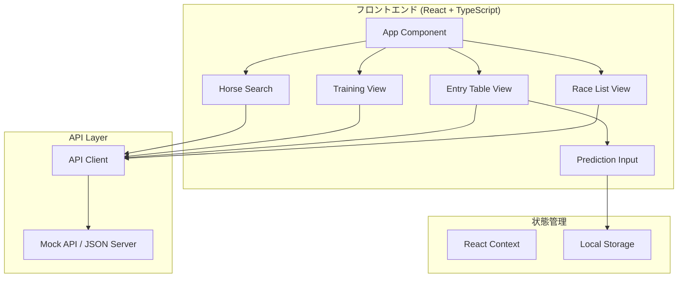

# Design Document: 競馬情報検索アプリ (Keiba Search)

## Overview

JRA中央競馬の競走馬情報検索Webアプリケーション。React + TypeScriptでフロントエンドを構築し、緑（#0142C2）を基調としたUIデザインを採用する。バックエンドAPIとの通信はREST APIで行い、予想印データはLocalStorageに保存する。

## Architecture



## Components and Interfaces

### コンポーネント構成

```
src/
├── components/
│   ├── common/
│   │   ├── Header.tsx          # ヘッダーナビゲーション
│   │   ├── Loading.tsx         # ローディングインジケーター
│   │   ├── ErrorMessage.tsx    # エラー表示
│   │   └── Button.tsx          # 共通ボタン
│   ├── race/
│   │   ├── RaceList.tsx        # 開催一覧
│   │   ├── RaceCard.tsx        # レースカード
│   │   └── DatePicker.tsx      # 日付選択
│   ├── entry/
│   │   ├── EntryTable.tsx      # 出馬表
│   │   ├── HorseRow.tsx        # 馬情報行
│   │   └── PastResults.tsx     # 近走成績
│   ├── training/
│   │   ├── TrainingTable.tsx   # 調教表
│   │   └── TrainingChart.tsx   # 調教グラフ
│   ├── search/
│   │   ├── HorseSearch.tsx     # 馬検索
│   │   ├── SearchResults.tsx   # 検索結果
│   │   └── HorseDetail.tsx     # 馬詳細
│   └── prediction/
│       ├── PredictionMark.tsx  # 予想印表示
│       └── MarkSelector.tsx    # 印選択メニュー
├── hooks/
│   ├── useRaces.ts             # レースデータ取得
│   ├── useEntries.ts           # 出馬表データ取得
│   ├── useTraining.ts          # 調教データ取得
│   ├── useHorseSearch.ts       # 馬検索
│   └── usePrediction.ts        # 予想印管理
├── services/
│   └── api.ts                  # API通信
├── types/
│   └── index.ts                # 型定義
├── utils/
│   ├── localStorage.ts         # LocalStorage操作
│   └── formatters.ts           # データフォーマット
└── styles/
    └── theme.ts                # テーマ設定
```

### インターフェース定義

```typescript
// 競馬場
interface Racecourse {
  id: string;
  name: string;        // 例: "東京", "中山"
  code: string;        // 例: "05", "06"
}

// レース
interface Race {
  id: string;
  date: string;        // YYYY-MM-DD
  racecourse: Racecourse;
  raceNumber: number;  // 1-12
  raceName: string;
  distance: number;    // メートル
  trackType: 'turf' | 'dirt';
  startTime: string;   // HH:mm
}

// 出走馬
interface Entry {
  id: string;
  raceId: string;
  horseNumber: number;
  horseName: string;
  jockey: string;
  weight: number;      // 斤量
  horseWeight: number; // 馬体重
  pastResults: PastResult[];
}

// 過去成績
interface PastResult {
  date: string;
  racecourse: string;
  distance: number;
  position: number;
  time: string;
}

// 調教データ
interface TrainingData {
  horseId: string;
  date: string;
  course: 'slope' | 'cw';  // 坂路 or CW
  times: number[];         // 1F〜のタイム
}

// 競走馬詳細
interface Horse {
  id: string;
  name: string;
  birthYear: number;
  sire: string;        // 父
  dam: string;         // 母
  damSire: string;     // 母父
  results: PastResult[];
}

// 予想印
type PredictionMark = '◎' | '○' | '▲' | '△' | '×' | null;

interface Prediction {
  raceId: string;
  horseNumber: number;
  mark: PredictionMark;
}
```

## Data Models

### LocalStorage構造

```typescript
// 予想印データ
interface StoredPredictions {
  [raceId: string]: {
    [horseNumber: number]: PredictionMark;
  };
}

// LocalStorageキー
const PREDICTION_KEY = 'keiba_predictions';
```

### API エンドポイント

| Method | Endpoint | Description |
|--------|----------|-------------|
| GET | `/api/races?date={date}` | 指定日の開催一覧取得 |
| GET | `/api/races/{raceId}/entries` | 出馬表取得 |
| GET | `/api/races/{raceId}/training` | 調教データ取得 |
| GET | `/api/horses?name={name}` | 馬名検索 |
| GET | `/api/horses/{horseId}` | 馬詳細取得 |


## Correctness Properties

*A property is a characteristic or behavior that should hold true across all valid executions of a system—essentially, a formal statement about what the system should do. Properties serve as the bridge between human-readable specifications and machine-verifiable correctness guarantees.*

### Property 1: 日付選択による開催一覧取得

*For any* 有効な日付を選択した場合、Race_List_Viewはその日付に対応する開催競馬場一覧を表示する

**Validates: Requirements 1.2**

### Property 2: レース番号の完全表示

*For any* 開催競馬場データが与えられた場合、Race_List_Viewは1R〜12Rのすべてのレース番号を一覧表示する

**Validates: Requirements 1.3**

### Property 3: 出馬表の必須情報表示

*For any* 出馬表データが与えられた場合、Entry_Table_Viewは馬番、馬名、騎手、斤量のすべてを表形式で表示する

**Validates: Requirements 2.1**

### Property 4: 近走成績の表示

*For any* 出走馬データが与えられた場合、Entry_Table_Viewは各馬の近5走の成績を表示する

**Validates: Requirements 2.2**

### Property 5: 調教タイムの表示

*For any* 調教データが与えられた場合、Training_Viewは坂路1F〜4FおよびCW1F〜6Fの調教タイムを表形式で表示する

**Validates: Requirements 3.1, 3.2**

### Property 6: 調教グラフの表示

*For any* 過去の調教データが与えられた場合、Training_Viewはグラフコンポーネントに正しいデータを渡してグラフを描画する

**Validates: Requirements 3.3**

### Property 7: 馬名部分一致検索

*For any* 検索文字列が与えられた場合、Horse_Searchは馬名に検索文字列を含むすべての馬を候補として返す

**Validates: Requirements 4.1**

### Property 8: 馬詳細情報の表示

*For any* 馬詳細データが与えられた場合、Horse_Searchは血統情報（父、母、母父）および過去戦績（タイム、着順）を表示する

**Validates: Requirements 4.2, 4.3**

### Property 9: 空検索の防止

*For any* 空文字列または空白のみの検索入力の場合、Horse_Searchは検索APIを呼び出さず現在の状態を維持する

**Validates: Requirements 4.5**

### Property 10: 予想印の表示更新

*For any* 予想印が選択された場合、Prediction_Inputは選択した印を出馬表の該当馬に表示する

**Validates: Requirements 5.2**

### Property 11: 予想印のラウンドトリップ保存

*For any* 予想印データが入力された場合、LocalStorageに保存し、再読み込み時に同じ予想印が復元される

**Validates: Requirements 5.3, 5.4**

### Property 12: 予想印の削除

*For any* 予想印がクリアされた場合、該当馬の予想印がLocalStorageから削除され、表示からも消える

**Validates: Requirements 5.5**

### Property 13: ローディング状態の表示

*For any* データ読み込み中の状態の場合、Keiba_Search_Appはローディングインジケーターを表示する

**Validates: Requirements 6.3**

### Property 14: エラー時のリトライボタン表示

*For any* エラー状態の場合、Keiba_Search_Appはリトライボタンを表示する

**Validates: Requirements 7.3**

## Error Handling

### エラー種別と対応

| エラー種別 | 検出方法 | ユーザーへの表示 | 対応アクション |
|-----------|---------|-----------------|---------------|
| ネットワークエラー | fetch失敗 | 「接続エラーが発生しました」 | リトライボタン表示 |
| サーバーエラー (5xx) | HTTPステータス | 「サーバーエラーが発生しました」 | リトライボタン表示 |
| データなし | 空レスポンス | 「データがありません」 | 日付変更を促す |
| 検索結果なし | 空配列 | 「該当する馬が見つかりません」 | 検索条件変更を促す |

### エラーハンドリング実装

```typescript
// API呼び出しのエラーハンドリング
interface ApiError {
  type: 'network' | 'server' | 'notFound';
  message: string;
}

const handleApiError = (error: unknown): ApiError => {
  if (error instanceof TypeError) {
    return { type: 'network', message: '接続エラーが発生しました' };
  }
  if (error instanceof Response && error.status >= 500) {
    return { type: 'server', message: 'サーバーエラーが発生しました' };
  }
  return { type: 'notFound', message: 'データが見つかりません' };
};
```

## Testing Strategy

### テストフレームワーク

- **Unit Tests**: Vitest
- **Property-Based Tests**: fast-check
- **Component Tests**: React Testing Library
- **E2E Tests**: Playwright (オプション)

### テスト方針

**Unit Tests**:
- 各コンポーネントの基本的なレンダリング
- カスタムフックの動作確認
- ユーティリティ関数のエッジケース

**Property-Based Tests**:
- 検索機能の部分一致ロジック
- LocalStorageのラウンドトリップ
- データフォーマット関数の一貫性

### テスト設定

```typescript
// vitest.config.ts
import { defineConfig } from 'vitest/config';

export default defineConfig({
  test: {
    environment: 'jsdom',
    globals: true,
    setupFiles: ['./src/test/setup.ts'],
  },
});
```

### Property-Based Test例

```typescript
import { fc } from 'fast-check';
import { filterHorsesByName } from './search';

// Property 7: 馬名部分一致検索
// Feature: keiba-search, Property 7: 馬名部分一致検索
test('部分一致検索は検索文字列を含むすべての馬を返す', () => {
  fc.assert(
    fc.property(
      fc.array(fc.record({ name: fc.string() })),
      fc.string({ minLength: 1 }),
      (horses, searchTerm) => {
        const results = filterHorsesByName(horses, searchTerm);
        return results.every(horse => 
          horse.name.includes(searchTerm)
        );
      }
    ),
    { numRuns: 100 }
  );
});
```
